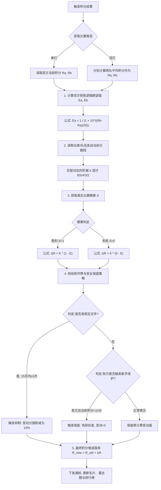

# 比赛确认流转与积分结算引擎 (Elo-based 详细数值版)

## 一、 比赛记分状态机 (Match State Machine)
要让分数有公信力，必须要有一套防赖账的模型，且充分考虑网球运动后休息交流的场景。
1. **建房 (Created)**：玩家A发起单打/双打比赛，生成房间二维码或微信卡片。
2. **准备 (Ready)**：其他玩家扫码加入。全员就位后，玩家A点击【确认开始】。此时快照各成员当前积分。
3. **比赛中 (Playing)**：系统开始计时。
4. **待确认 (Pending Confirm)**：完赛后，由**胜方**（或单方代表）录入最终比分并点击提交。此时通过微信订阅消息通知其他人【请确认比分】。
5. **已生效 (Settled)**：
   - 触发条件 A（主动）：对手在小程序内点击【确认无误】（立即生效）。
   - **触发条件 B（超时静默生效）**：防止对手“因输赢情绪而拒绝点确认”，如果提交比分后 **1 小时（60 分钟）** 内对手无动作，则判定为默认同意，自动流转为已生效。
   - *PM注：设置 1 小时是因为打完球通常会一起休息、喝水或拉伸，这是核对赛果的黄金窗口期。一旦解散回家，容易遗忘细节并极大地增加履约漏斗的流失率。*
6. **争议态 (Disputed)**：
   - 对手如果在 1小时 内选择【驳回比分】，系统挂起比赛并通知提交者。需双方线下沟通后由发起人重新录入。超过 24 小时未解决，该场记录作废作废处理，不计分。

---

## 二、 核心算法：微调网球版 Elo 积分公式

我们的系统积分为 **0-100分制**（映射 NTRP 2.0-5.0+）。传统的国际象棋 Elo（通常在 1000~2800 之间，缩放中值 D 为 400）不适用。我们需要将公式进行特定的数值缩放。

### 积分结算算法流转图

为了更直观地展示每一场比赛完赛后的积分结算全过程（包含双打转换、Elo系数与防作弊校验），我们设计了如下算法数据流程图：

### 1. 胜率期望值公式 (Expected Win Rate)
结合网球规律，我们设定 **20 分的积分差** 代表一个完整档次（如 3.0 打 2.0）。在这个档次差距下，高分者应该具备压倒性优势（对应数学胜率预期约为 91%）。因此我们将公式的缩放因子 $ 设置为 20。

**玩家 A 的获胜期望计算公式：**
UTF8 E_a = \frac{1}{1 + 10^{(R_b - R_a) / 20}} UTF8
*(其中 $ 和 $ 为A、B玩家赛前的历史总积分，$ 是 A 玩家赢球的数学概率 0~1)*

### 2. 阶梯级 K 因子动态权重 (Dynamic K-Factor)
如您所预期的：**用户所处的等级越高，遇到的瓶颈与阻力应该越大，晋升所需的净胜场次也必须成倍增加。** 网球从 2.5 冲 3.0 很容易，但从 4.0 冲 4.5 难如登天。
因此，我们**放弃全局单一 K 值**，引入**阶梯衰减 K 因子体系**：

| 分数段 (当前积分) | 对应 NTRP | K 因子 | 晋级阻力评估 |
|-------------------|-----------|--------|--------------|
| **(前5场定级赛)** | -         | 8      | 单场涨跌最剧烈，快速寻找真实位置 |
| **0 - 29 分**         | < 3.0     | **5**  | 进步期 (萌新/潜力股)，只需少量胜场即可明显感受到进步 |
| **30 - 59 分**        | 3.0 - 3.5 | **4**  | 平台期 (实力派/狠角色)，绝大多数球友停留的基数庞大阶段 |
| **60 - 74 分**        | 4.0 - 4.5 | **3**  | 精英期 (真大神)，面对同级对手涨分开始变得困难 |
| **75 分及以上**       | 5.0+      | **2**  | 大破防期 (大魔王/宗师)，积分系统极度收紧，涨 1 分都极难 |

### 3. 积分结算公式 (Rating Update)
赛后的最终结算是：
UTF8 R_{new} = R_{old} + K \times (S - E) UTF8
*(其中 $ 为真实结果：赢家 =1$，输家 =0$)*

---

## 三、 具体数值推演案例与晋级路线测算

基于最新的 **7档荣誉等级（跨度15分/档）**，为了验证**“高等级进阶是否需要更多净胜场次”**这一核心猜想，我们只核算**稳扎稳打（赢同级别/同分数的对手）**的路线。
在同分数对战中，期望胜率永远是 0.5（五五开）。
*公式：每一场同级胜场加分 = K $\times$ (1 - 0.5) = .5K$*

**推演 1：初学跃升期 (【萌新】 晋升 【潜力股】)**
- 起点：0分。目标：15分（需跨度 15分）。
- 所处区域 K值：5。
- 单场同级胜利得分： \times 0.5 =$ **+2.5 分**。
- **需要净胜场次： / 2.5 = $ 6 场。**
- *结论：初期进步神速，只需要比输的多赢 6 场即可升段，给予用户极大的爽感和反馈。*

**推演 2：迈向大众及格线 (【潜力股】 晋升 【实力派】)**
- 起点：15分。目标：30分（需跨度 15分）。
- 所处区域 K值：5。
- 单场同级胜利得分： \times 0.5 =$ **+2.5 分**。
- **需要净胜场次： / 2.5 = $ 6 场。**
- *结论：依然处于蜜月期，积累一定胜场就能进入庞大的大众基准群“实力派”。*

**推演 3：业余瓶颈区 (【实力派】 晋升 【狠角色】)**
- 起点：30分。目标：45分（需跨度 15分）。
- 所处区域 K值：4。
- 单场同级胜利得分： \times 0.5 =$ **+2.0 分**。
- **需要净胜场次： / 2.0 = 7.5 $\approx$ 8 场。**
- *结论：所需胜场量增加了 33%，涨分开始变慢，跨过这道槛需要实打实的技战术提升。*

**推演 4：冲击精英圈 (【狠角色】 晋升 【真大神】)**
- 起点：45分。目标：60分（需跨度 15分）。
- 所处区域 K值：4。
- 单场同级胜利得分： \times 0.5 =$ **+2.0 分**。
- **需要净胜场次： / 2.0 = 7.5 $\approx$ 8 场。**
- *结论：成为球场上的硬茬后，想再突破到大神级别，同样需要大量的硬仗积累。*

**推演 5：强强对决 (【真大神】 晋升 【大魔王】)**
- 起点：60分。目标：75分（需跨度 15分）。
- 所处区域 K值：3。
- 单场同级胜利得分： \times 0.5 =$ **+1.5 分**。
- **需要净胜场次： / 1.5 = $ 10 场。**
- *结论：在这个神仙打架的分段，面对同样极少失误的对手，需要额外净胜 10 场硬仗才能晋级级，含金量极高。*

**推演 6：问鼎巅峰 (【大魔王】 晋升 【宗师】)**
- 起点：75分。目标：90分（需跨度 15分）。
- 所处区域 K值：2。
- 单场同级胜利得分： \times 0.5 =$ **+1.0 分**。
- **需要净胜场次： / 1.0 = $ 15 场。**
- *结论：在接近职业边缘的分段中，哪怕保持 60% 这种极其恐怖的同级对决胜率，也需要打 75 场硬仗（赢45输30，净胜15）才能登顶。完美反映了网球运动高处不胜寒的残酷性。*

---
### （附录）经典错位对抗（爆冷与虐菜）示例计算
- **碾压局 (70分 大神打 50分 萌新)**：分差 20分，系统算准了 70分大神有 91% 的胜率。
    - 大神赢了：该分段 K=3。大神只加  \times (1 - 0.91) =$ **+0.27 分**。
    - 大神输了（爆冷）：被倒扣  \times (0 - 0.91) =$ **-2.73 分**。
    - *PM 释义：彻底斩断高手去新手群里“虐菜刷分”的动机。赢了毫无收益，一次爆冷翻车就会血亏（相当于白赢 10 场）。*

---

## 四、 双打换算与防作弊规则

**1. 双打积分池提取**
- 双打判定将**双方队伍两人的积分求算术平均值**，作为队伍的整体积分 $，代入上方 Elo 公式。
- 算出队伍的胜负加扣分后，均匀作用到队内两人身上。（例如队伍获胜+2.0分，则两人各自+2.0分）。

**2. 防“互刷”墙机制 (Anti-Smurf)**
- 任何固定两名对手（或固定双打组合），在自然天 **15天内** 第 3 次交手起，所产生的 Elo 变动系数 $ 强制衰减为常态的 **10%**。
- 这意味着如果两人天天在小区只和对方互打，之后的分数涨跌只有极低的分值，切断了“好友商量好假赛互刷分”的商业路径。

**3. 保底缓冲**
- 为了秉承绝对的严肃性与客观性，**系统不做常规输方补偿**，完全零和博弈。
- 唯一的保底是：低于 **10分** 的新手，输球不再产生扣分。
