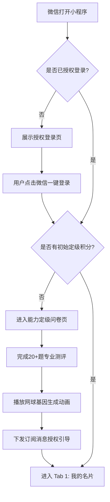
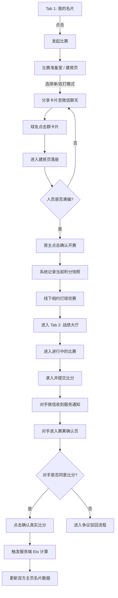
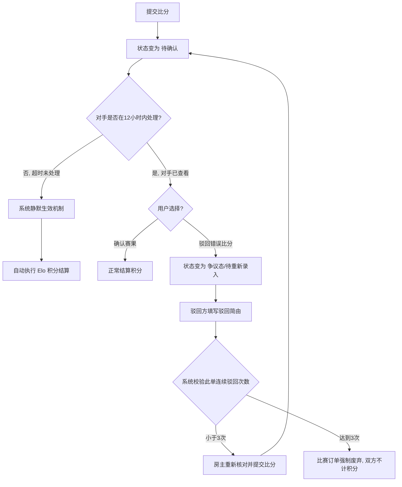

# 页面交互与流程设计 (UI/UX & Interaction Flow)

**文档目的**：基于产品方案设计，梳理网球名片小程序 v1.0 的页面清单、单页交互细节、页面流转关系以及各项异常业务场景的处理方案，指导 UI 设计与前端开发。

---

## 1. 小程序页面清单与层级结构 (Page Inventory & Hierarchy)

整个小程序围绕“工具效率”核心，采用经典的底部三 Tab 导航结构，辅以多个独立的功能流程页。

### 1.1 基础层级目录
*   **Root (根逻辑)**
    *   **Tab 1：我的名片 (Home/Card)**：个人积分、能力雷达、发起比赛首要入口。
    *   **Tab 2：战绩大厅 (History)**：待办提醒、历史赛事流。
    *   **Tab 3：排行榜 (Leaderboard)**：好友/同城积分排名。
*   **独立功能页 (Standalone Pages)**
    *   登录授权页 (Auth)
    *   初始能力定级问卷页 (Assessment)
    *   比赛准备室/建房页 (Match Room)
    *   比分录入与赛果提交页 (Score Entry)
    *   赛果详情与确认页 (Match Detail & Confirm)
    *   名片分享海报页 (Share Poster)

---

## 2. 页面详细设计与用户任务 (Page Details & Interactions)

### 2.1 引导与登录流程 (Onboarding)
**1. 登录授权页**
*   **用户任务**：完成微信身份认证，搭建用户基础画像。
*   **信息展示**：品牌 Logo、产品愿景标语、授权说明。
*   **交互能力**：微信一键登录获取头像昵称；用户真实性别选择（影响头像框/默认UI，但不影响当前算分池）。

**2. 初始能力定级问卷页**
*   **用户任务**：完成基准水平测试，获取初始积分（替代主观的传统 NTRP 自评）。
*   **信息展示**：当前题号（如 3/23）、题目描述（如：你的正手击球稳定性如何？）、选项列表。
*   **交互能力**：单题卡片式滑动答题，选项点击后自动滑至下一题。答题完毕首屏呈现渲染动画：“正在生成您的专属网球能力基因...”。

### 2.2 底部导航主页面 (Main Tabs)
**3. Tab 1: 我的名片 (Home)**
*   **用户任务**：快速了解自身竞技状态，对外展示，快速发起比赛。
*   **信息展示**：
    *   当前综合积分（核心大字号），以及映射的 NTRP 等级（如 3.5）。
    *   动态能力五维雷达图（底线、发球、接发、网前、战术）。
    *   战绩摘要：总场次、胜/负场、当前连胜/连败 Label。
*   **交互能力**：
    *   页面居中/底部悬浮大核心按钮：**【发起比赛】**。
    *   右上角/名片模块点击：**【分享名片】**（生成带小程序码的精美名片海报，便于分享至微信群/朋友圈）。

**4. Tab 2: 战绩大厅 (Match History)**
*   **用户任务**：处理比赛赛果确认待办，回顾历史战绩。
*   **信息展示**：
    *   **Action Bar (待办提醒)**：置顶强提醒（如：“您有 1 场双打赛果待确认”，红色角标）。
    *   **历史赛果流**：按时间倒序排布的比赛卡片（包含：赛况日期、对手头像昵称、比分、胜负状态、积分变动值如 [+12 分]）。
*   **交互能力**：点击一条具体战绩，进入【赛果详情页】。

**5. Tab 3: 排行榜 (Leaderboard)**
*   **用户任务**：了解自己在圈子内的水平生态。
*   **信息展示**：名次排名、用户头像、昵称、综合积分、胜率。
*   **交互能力**：顶部提供 Tab 切换（“好友榜”、“同城/全国榜”）。点击列表中的用户可查看其实力名片（不可越权看详实赛果，仅展示公开雷达图）。

### 2.3 核心业务流程页面 (Core Match Flow)
**6. 比赛准备室/建房页**
*   **用户任务**：组局落座，锁定比赛阵容。
*   **信息展示**：当前模式（单打 1v1 或双打 2v2）、A 队位列席、B 队位列席（空缺时显示“等待加入”）、各用户当前积分及队伍平均分。
*   **交互能力**：
    *   房主选择模式（单/双打）。
    *   点击空位发送组局邀请卡片至微信聊天/群聊。
    *   其他用户扫码/点击卡片加入空位。
    *   满员时房主高亮显示**【确认开赛】**按钮，点击后快照记录当前人员实力基数，比赛状态变更为“进行中”。

**7. 比分录入与详情确认页**
*   **用户任务**：如实反映战果，严肃积分机制。
*   **信息展示**：比赛双方阵容与头像、比分展示区、状态标语（如“等待对手确认”）。
*   **交互能力**：
    *   **录入态**：房主（或胜方）调起定制数字键盘，输入当局比分（如 6:4）。
    *   **确认态（接收方）**：确认无误点击**【确认真实比分】**；有异议点击**【驳回，比分有误】**。

---

## 3. 页面流转关系图 (User Flow)

为了便于理解，以下通过流程图的形式对核心用户场景的流转路径进行刻画：

### 3.1 首次冷启动与定级流转 (Cold Start Flow)

### 3.2 比赛发起至完赛结算闭环 (Match Lifecycle Flow)

### 3.3 赛果驳回与超时静默确认流转 (Exception Flow)

---

## 4. 异常情况与防御性设计 (Exception Handling & Edge Cases)

在熟人或半熟人网球社交中，操作延误与人为纠纷是最高频的异常，系统需做以下防御设计：

### 4.1 赛果确认超时 (防止死局)
*   **痛点**：打完球大家各自回家，败方不愿意打开小程序确认比分，导致比赛悬而未决。
*   **处理方案（静默生效机制）**：一方录入比分后，系统下发通知给另一方。自录入时间起计算，若 **12 小时后** 对手既未确认也未驳回，系统将视为**默认同意**，自动执行比分通过及 Elo 积分结算。

### 4.2 赛果被驳回与争议 (恶意报错)
*   **痛点**：某人为了虚荣故意填错比分。
*   **处理方案**：对手在确认页点击【驳回】后，需选择或简填驳回理由（如：比分反了/比分录入错误）。此时该场比赛打回“待录入比分”状态。若连续被驳回超过 3 次，该场订单作废，防止刷单。双方积分不发生变化。

### 4.3 意外退出问卷定级
*   **痛点**：23道题较长，用户中途切出微信回消息导致小程序被销毁。
*   **处理方案**：前端实时将答题进度记入缓存（或服务端），用户重新进入小程序时，跳过已答题目，直接从断点处继续。

### 4.4 弱网与高并发防刷 (技术异常)
*   **痛点**：球场信号差，用户狂点“提交比分”或“确认比分”。
*   **处理方案**：
    *   **前端**：按钮点击后立刻 Disable，并展示全局 Loading Modal（防止遮罩穿透）。
    *   **后端**：核心赛果结算接口必须加分布式锁，保证一场比赛的订单 `match_id` 只能被成功结算一次，杜绝同一场比赛被多次算分导致的逻辑雪崩。

### 4.5 久未参赛的积分注水 (防潜水)
*   **痛点**：用户达到高分后，害怕掉分而拒绝比赛，丧失动态名片的意义。
*   **处理方案（降权机制储备）**：在 v1.0 可不立刻上线，但在设计时预留机制。若用户超过 30 天未发生任何比赛确认行为，其名片上显示“活跃度低/隐匿”状态，排行榜中屏蔽，直至参加下一场比赛重新激活。